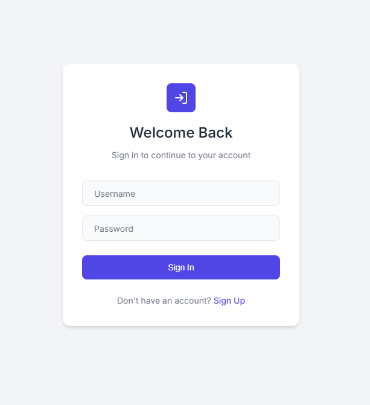
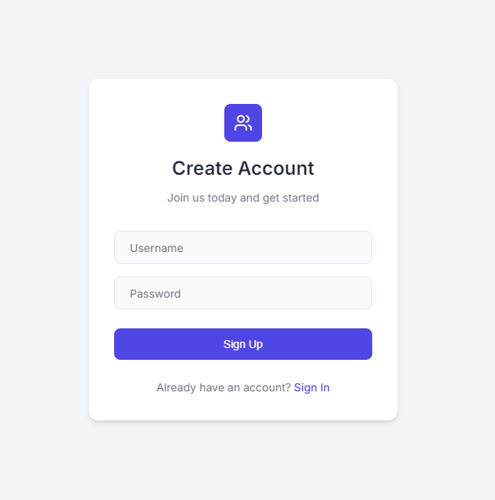
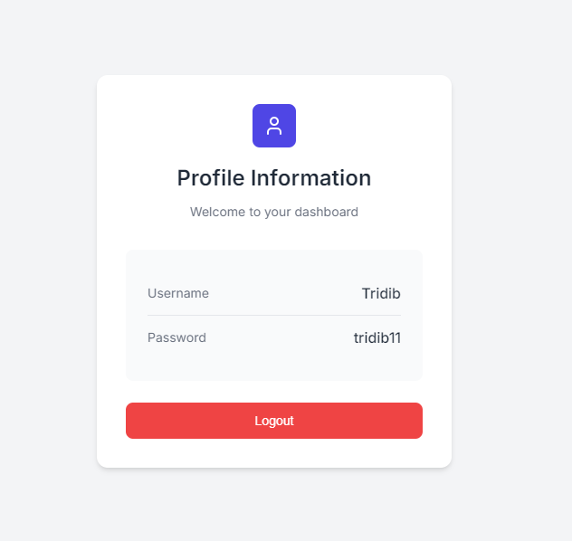

# Modern Auth Portal

This project is a front-end application for a simple authentication system. It provides user-friendly interfaces for **Sign Up**, **Sign In**, and **Profile Management**. The app is styled with modern design principles and interacts with an in-memory backend API.

## Features
- **Sign Up**: Create a new account.
- **Sign In**: Log in and receive a token.
- **Profile Management**: View user information after authentication.
- **Responsive Design**: Optimized for both desktop and mobile devices.
- **Notification System**: Success and error notifications for user actions.

## Live Demo
- **Frontend**: [https://tridibs-in-memory-authentication.netlify.app](https://tridibs-in-memory-authentication.netlify.app)  
- **Backend API**: [https://tridibs-in-memory-authentication-api.onrender.com](https://tridibs-in-memory-authentication-api.onrender.com)  

## Installation and Setup

### 1. Clone the Repository
```bash
git clone https://github.com/Tridib11/Authentcation-UI.git
```

### 2. Open the Project
Simply open the `index.html` file in your preferred browser to view the app locally.

### 3. Backend API
Make sure the backend API is running and accessible at [https://tridibs-in-memory-authentication-api.onrender.com](https://tridibs-in-memory-authentication-api.onrender.com).  
For backend details, visit the [Backend GitHub Repository](https://github.com/Tridib11/Authentication-api).

## Project Structure
```
.
├── index.html         # Main HTML file
├── style.css          # Embedded in <style> tags
├── README.md          # Documentation
```

## How It Works

### 1. Sign Up
- Allows users to create an account by providing a username and password.
- Sends a `POST` request to `/signup`.

### 2. Sign In
- Authenticates users and retrieves a JWT token.
- Sends a `POST` request to `/signin`.

### 3. Profile Management
- Fetches user details using the JWT token.
- Sends a `GET` request to `/me`.

### 4. Logout
- Clears the JWT token and returns to the Sign In page.

## Technologies Used
- **HTML5**: Structure and layout.
- **CSS3**: Styling and responsive design.
- **JavaScript**: Client-side logic and API interactions.
- **Axios**: HTTP requests to the backend API.
- **LocalStorage**: Stores the JWT token for authenticated sessions.

## Notifications
The app includes a built-in notification system to inform users about the success or failure of their actions, such as:
- Successful sign-up or sign-in
- Errors during API calls
- Profile fetching issues

## Screens
- **Sign In**  
  
  

- **Sign Up**  
  
  

- **Profile**  
  
  

## License
This project is open-source and available under the MIT License.

## Author
**Tridib**  
[GitHub](https://github.com/Tridib11)